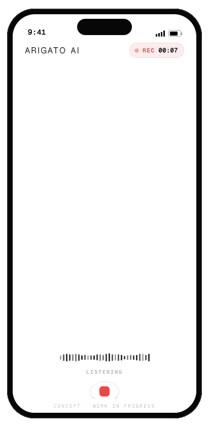
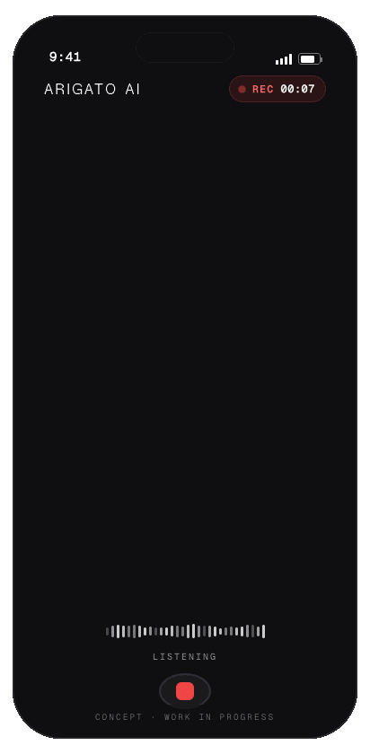
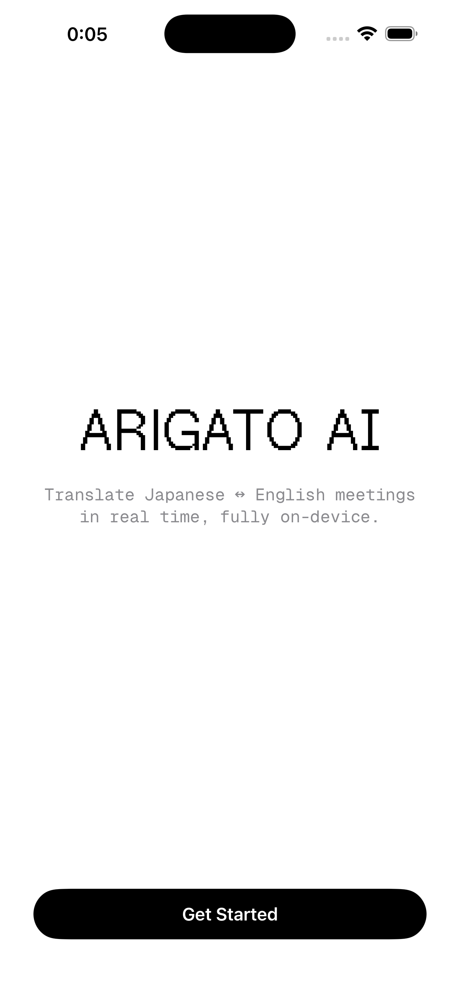
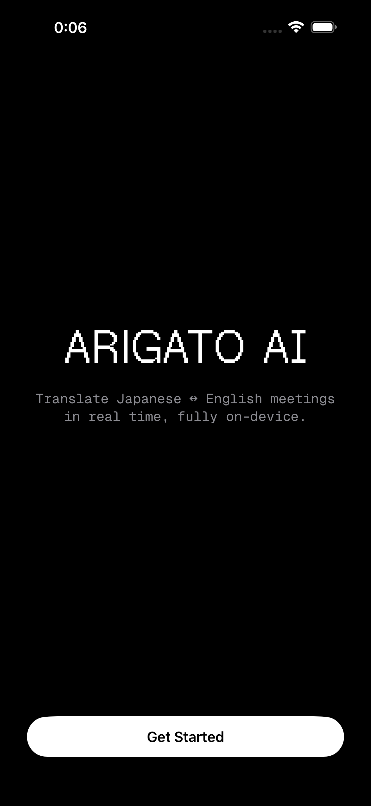
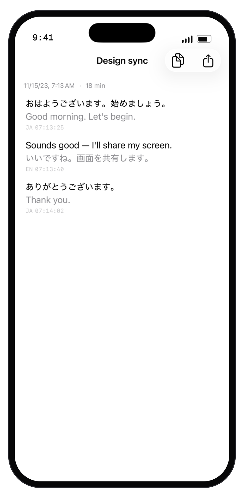
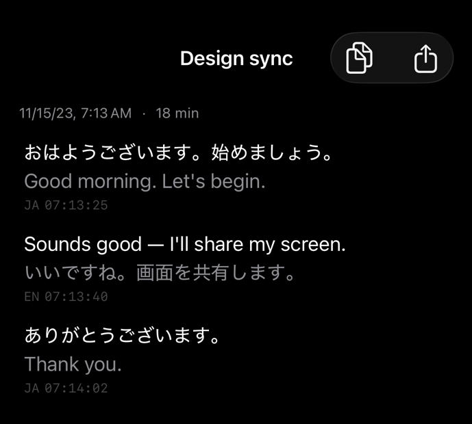

# Arigato AI

**On-device, bidirectional Japanese ↔ English live meeting translator for iPhone.**

Arigato AI listens to a live conversation, transcribes it, and renders streaming bilingual captions in real time — Japanese and English, in both directions — **entirely on the device**. No audio ever leaves the phone. No network calls during a meeting. No accounts, no logins, no telemetry.

It runs a **350M-parameter LFM2 translation model** (Liquid AI) and a **Whisper large-v3-turbo** speech model (Argmax / WhisperKit) locally on an iPhone 17 Pro Max, with both models pre-warmed at launch so captions start the moment you do.

> 🚧 **Work in progress.** Arigato AI is an active, in-development personal project — **not a finished app.** The on-device pipeline (speech recognition → translation → persistence) is implemented and unit-tested, but it hasn't been validated in real meetings yet and the interface is mid-polish. Expect rough edges. See [Status](#status) for an honest breakdown of what's real today versus what's still ahead.

> ありがとう — *thank you.* Named for the first word most people learn in a new language, and the one this app is built to help you say across one.

---

## Concept preview

This is the live translation experience the project is building toward — a split-screen live view with **Japanese on top and English on the bottom**, each line transcribed and translated on-device as it happens, timestamps correlating every pair. Light and dark:

<p align="center">
  
  &nbsp;
  
</p>

<p align="center"><sub>The split-screen live view — Japanese top, English bottom, timestamps correlating each pair. Light mode (left), dark mode (right). Animated design concept — showing the target experience. Work in progress.</sub></p>

---

## Real screens (today)

The first-launch brand moment, captured from the app running in the simulator — real UI, light and dark:

<p align="center">
  
  &nbsp;&nbsp;&nbsp;
  
</p>
<p align="center"><sub>A terminal-style power-on animation types the wordmark in. The brand type is the bundled Geist Pixel face.</sub></p>

---

## Highlights

- 🎙️ **Real-time bidirectional translation** — JA→EN and EN→JA, auto-detected per utterance. No "pick a language" toggle; the app figures out who's speaking which language and routes accordingly.
- 🔒 **100% on-device** — speech recognition *and* translation run locally. Transcripts stay on the phone unless *you* explicitly export or copy them. iCloud/CloudKit sync is deliberately disabled.
- ⚡ **Built for latency** — Whisper `large-v3-turbo` for fast streaming ASR, LFM2-350M (Q5_K_M) for fast translation, both pre-warmed at app launch to kill cold-start glitches.
- 🧱 **Real, tested architecture** — a fully actor-isolated streaming pipeline, SwiftData persistence with crash-resilient auto-save, meeting history with full-text search, Markdown export, and 400+ tests (Swift Testing).
- 📝 **Post-meeting AI summary** — one-tap "Copy transcript" exports clean bilingual Markdown to paste into your AI assistant of choice.

---

## How it works

Every stage of the live pipeline is its own actor or isolated type — audio, transcription, routing, and translation never share mutable state across boundaries.

```
🎤  Microphone
    AVAudioEngine actor → 16 kHz mono PCM, AsyncStream of frames
        │
        ▼
🗣  WhisperKit streaming ASR  (large-v3-turbo, on-device)
    5 s window / 1 s hop  ·  per-window language detection (JA / EN)
        │
        ▼
🧭  LanguageRouter
    consecutive-window disagreement gating (N = 2) → stable language tag
    → chooses translation direction (JA→EN or EN→JA)
        │
        ▼
🌐  LFM2-350M-ENJP-MT  (LEAP iOS SDK, on-device, streaming)
    bidirectional JA↔EN translation, prompt-cache enabled
        │
        ▼
💾  SwiftData  (Meeting / Sentence via a @ModelActor store)
    every finalized line auto-saved — crash-resilient
        │
        ▼
📱  SwiftUI
    streaming split-screen bilingual captions, source-led hierarchy
```

The router consumes the language gate's **authoritative** tag, not a raw per-window guess — so a half-sentence is never pushed through the wrong translation direction while detection is still settling.

<p align="center">
  
  &nbsp;&nbsp;&nbsp;
  
</p>
<p align="center"><sub>A saved meeting (real UI, rendered from the actual SwiftUI view). Each line leads with the language actually spoken — JA or EN — translation beneath, monospace timestamp + language tag. Full light/dark parity.</sub></p>

---

## On-device translation with LFM2

The translation core is **[LFM2-350M-ENJP-MT](https://www.liquid.ai/)** — Liquid AI's bidirectional English↔Japanese machine-translation model — loaded through the **[LEAP iOS SDK](https://github.com/Liquid4All/leap-ios)**.

| | |
|---|---|
| **Model** | LFM2-350M-ENJP-MT |
| **Quantization** | Q5_K_M (GGUF, ~248 MB, bundled via Git LFS) |
| **Runtime** | LEAP iOS SDK — `Liquid4All/leap-ios` v0.9.4 |
| **Direction** | Bidirectional JA↔EN, selected per utterance by the language router |
| **Execution** | Fully on-device, streaming token output, prompt cache enabled |
| **Warmup** | Loaded and warmed at app launch alongside Whisper |

Running a capable MT model in 350M parameters means translation fits comfortably on-device next to a Whisper model — which is the entire premise of the app: a private, offline, real-time translator that never phones home.

---

## Tech stack

| Layer | Choice |
|---|---|
| **Language** | Swift (6.3 toolchain) — actors, `async`/`await`, `Sendable`, `@Observable`, main-actor-default isolation |
| **UI** | SwiftUI (iOS 26) |
| **Persistence** | SwiftData (`@ModelActor`, no Core Data, no iCloud) |
| **Speech-to-text** | WhisperKit via Argmax's [`argmax-oss-swift`](https://github.com/argmaxinc/argmax-oss-swift) v1.0.0 — `large-v3-turbo` |
| **Translation** | LFM2-350M-ENJP-MT via [LEAP iOS SDK](https://github.com/Liquid4All/leap-ios) v0.9.4 |
| **Testing** | Swift Testing (Xcode 26 framework), 400+ tests incl. concurrency-violation tests |
| **Target** | iPhone 17 Pro Max · iOS 26.4+ · Xcode 26.5 |

---

## Project structure

```
ArigatoAI/
├── Audio/            AVAudioEngine capture actor, mic permissions, VU metering
├── Transcription/    WhisperKit streaming, LanguageRouter, live caption view
├── Translation/      LFM2 / LEAP integration, TranslationActor, cache config
├── Session/          MeetingSession · MeetingCoordinator · MeetingPipeline (orchestration)
├── Persistence/      SwiftData Meeting / Sentence models, @ModelActor store, search
├── Views/            SwiftUI screens — history, detail, controls, settings
├── Onboarding/       First-launch brand moment + permission flow
├── Export/           Bilingual Markdown transcript export + share sheet
├── Navigation/       Value-based AppRoute routing
├── Design/           Design-system tokens (color, typography, spacing)
├── Resources/        Bundled LFM2 GGUF model + Geist display fonts
└── AppBootstrapper   Model pre-warm + dependency wiring at launch
```

---

## Getting started

> **Important:** the LFM2 model file (~248 MB) is tracked with **Git LFS**. Without LFS you'll get a small pointer file instead of the real model, and the app will fail to load LFM2 at launch.

```bash
git clone https://github.com/OnigiriMerchant/arigato-ai.git
cd arigato-ai

brew install git-lfs       # if not already installed
git lfs install --local    # enable LFS hooks for this repo
git lfs pull               # pull the ~248 MB LFM2 GGUF

open ArigatoAI.xcodeproj
```

Then build and run on an **iPhone 17 Pro Max** simulator (iOS 26.4) or device. Real microphone audio requires a physical device.

---

## Privacy

Privacy is a hard requirement, not a feature:

- **No audio leaves the device.** Capture, transcription, and translation are all local.
- **No cloud sync.** iCloud / CloudKit are explicitly disabled. Transcripts live only on the phone.
- **No analytics, no tracking, no telemetry.**
- **You own export.** Transcripts only leave the device when you explicitly Copy or Share them — you choose the destination.

---

## Status

**Active development — not a finished product.** The core feature set is implemented and unit-tested (400+ tests, Swift Testing), but the app has not yet been validated in real meetings and the UI is mid-polish. The animated [concept preview](#concept-preview) above shows where the experience is headed, not where it is today.

**Implemented (built + tested):**

- ✅ Start/stop meeting capture with live bilingual captions
- ✅ Bidirectional JA↔EN translation, auto-routed per utterance
- ✅ Crash-resilient auto-save to SwiftData
- ✅ Meeting history with full-text search
- ✅ Bilingual Markdown export + native share sheet
- ✅ Swipe-to-delete with undo, bulk delete from Settings
- ✅ Copy-transcript → external AI-summary workflow
- ✅ First-launch onboarding brand moment

**Still ahead:**

- 🔜 Validation in real Japanese↔English meetings (the main gate)
- 🔜 UI polish pass — design-language rollout, remaining brand moments, app icon
- 🔜 On-device tuning (latency/quality) once real-world usage reveals the priorities

This is a personal project — built for personal use first, with a possible App Store release later if it earns it.

---

## Acknowledgments

Arigato AI stands on excellent open work:

- **[Liquid AI](https://www.liquid.ai/)** — the LFM2-350M-ENJP-MT translation model and the [LEAP iOS SDK](https://github.com/Liquid4All/leap-ios).
- **[Argmax](https://github.com/argmaxinc)** — WhisperKit, via [`argmax-oss-swift`](https://github.com/argmaxinc/argmax-oss-swift) (Apache-2.0).
- **[Geist](https://github.com/vercel/geist-font)** — display typeface for the app's brand moment (SIL Open Font License 1.1).

Third-party models, SDKs, and fonts remain subject to their respective licenses.

---

*Built for iPhone 17 Pro Max. Made to help conversations cross a language — privately, on-device, in real time.*
